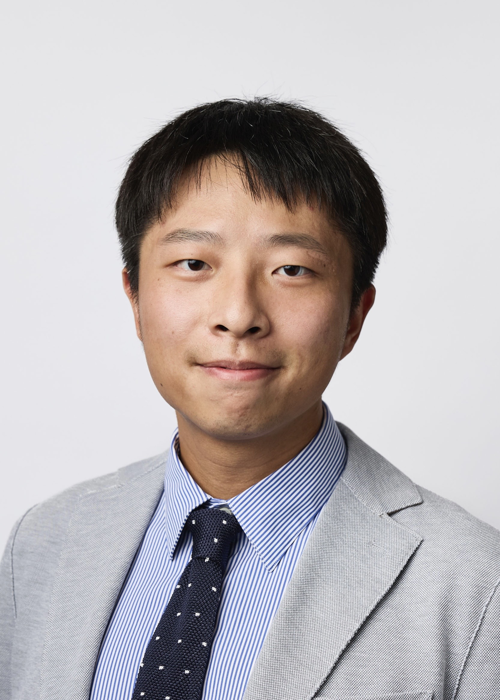

# "Hello — morning, noon, and night!"

  <!-- Photo (left, smaller, aligned with text) -->
  

    
  

  <!-- Intro (right, default text size) -->
  

    

      Hi there, and welcome! I’m a <strong>Postdoctoral Research Fellow in Finance</strong> at the Tuck School of Business, Dartmouth College, with a PhD from UNSW Business School.       My research interests include corporate finance, product market competition, entrepreneurial finance, and international trade.
      My work has been presented at conferences such as CICF, FMA, FIRN, and AFBC.
    

  

## Education

- 2025 - current **Post-Doc** in Finance, Tuck School of Business, Dartmouth College
- 2020 - 2024 **Ph.D.** in Finance, University of New South Wales
- 2019 - 2020 **Pre-Doc** in Finance, University of New South Wales
- 2016 - 2018 **MPhil** in Finance, University of New South Wales
- 2012 - 2016 **Bachelor** of Economics (major in Finance), Nanjing Normal University

## Contact

- Email (preferred from Sep 2025): [Huaizhou.Li@tuck.dartmouth.edu](mailto:Huaizhou.Li@tuck.dartmouth.edu)
- Email (active but not checked regularly): [huaizhou.li@unsw.edu.au](mailto:huaizhou.li@unsw.edu.au)

## News

- 2024-10-21: Came back from the **FMA Annual Meeting 2024**. Tiring travel, but I'm glad to meet with old friends and make new ones.
- 2024-07-17: It was such a great experience presenting my paper ["Startup Press Releases"]() at the **Monash Winter Finance Conference 2024**. Shout-out to [Ying Dou](https://research.monash.edu/en/persons/ying-dou), my wonderful discussant and respectful senior.
- 2024-04-15: My paper ["Startup Press Releases"]() with Leo Liu, Peter Pham and Jason Zein has been accepted for presentation at the **FMA Asia/Pacific 2024**.
- 2024-04-04: My paper ["Startup Press Releases"]() with [Leo Liu](https://leoliu0.github.io/), [Peter Pham](https://sites.google.com/view/peterkienpham/home) and [Jason Zein](https://www.jasonzein.com/) has been accepted for presentation at the **CICF 2024**.
- 2023-12-12: Finished my one-term visiting at Tuck School of Business, Dartmouth College. Many thanks to my wonderful host, [Prof. Gordon Phillips](https://facultynew.tuck.dartmouth.edu/gordon-phillips/). It is so nice to get back at Sydney before the severe winter in Hanover.

